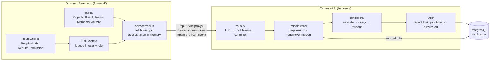
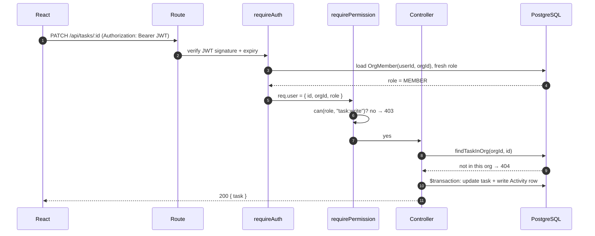
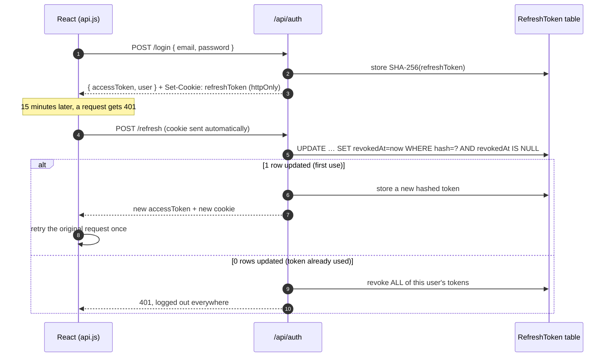
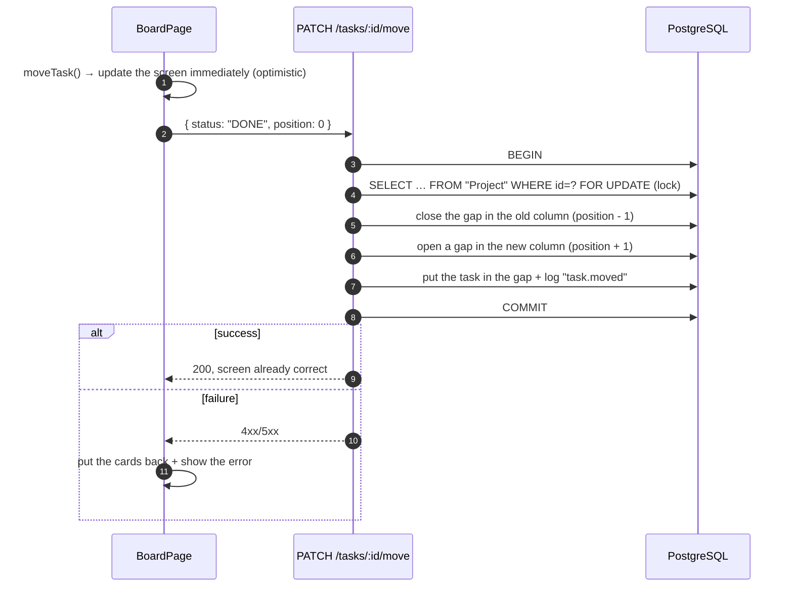
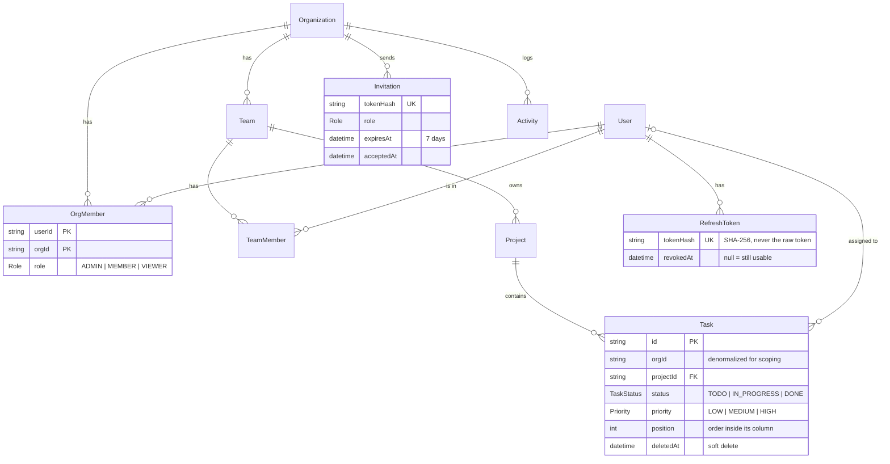

# Taskboard: a multi-tenant project manager

A project manager for teams. An **organization** has **teams**, teams own **projects**, and every project has a **Kanban board** of tasks. Many organizations share one database, and none of them can see another's data.

Built with **React + Express + Prisma + PostgreSQL**.

**Live demo: [taskboard-bf5e.onrender.com](https://taskboard-bf5e.onrender.com)**. On the login page, click **admin**, **member** or **viewer** to sign in as that role (password `password123`). It's on Render's free plan, so the first load after it has been idle can take about a minute.

- **4 tenant layers:** organization → team → project → task. Every tenant-owned row stores `orgId`.
- **28 REST endpoints.** Every one that touches tenant data (23 of 28) filters by the caller's `orgId`. Asking for another org's record returns **404, not 403**, so the API never confirms that it exists.
- **Auth:** 15-minute JWT access tokens, plus refresh tokens that are **stored hashed, single-use, and rotated**. **Reuse detection** logs the user out of every device.
- **3 roles (Admin, Member, Viewer).** The role is **re-read from the database on every request** and mirrored in **React Router guards**.
- **Kanban:** drag-and-drop with **optimistic UI** and rollback, **transactional reordering** under a row lock, and task **priorities**.
- **Soft deletes**, an **audit activity log** written in the same transaction as each change, and **invite links** with a full member lifecycle.

---

## Table of contents

1. [Tech stack](#tech-stack)
2. [Architecture](#architecture)
3. [Request flows](#request-flows)
4. [Data model](#data-model)
5. [Roles and permissions](#roles-and-permissions)
6. [Key decisions](#key-decisions)
7. [API reference](#api-reference)
8. [Project structure](#project-structure)
9. [Getting started](#getting-started)
10. [Deploying](#deploying)
11. [Known limitations](#known-limitations)

---

## Tech stack

| Layer | Choice | Why this one |
|---|---|---|
| Frontend | **React 19** + **Vite** | Fast dev server; the proxy lets the API share the app's origin |
| Routing | **React Router 7** | Route guards (`RequireAuth`, `RequirePermission`) are plain components |
| Styling | **Tailwind CSS 4** | Styles sit next to the markup; no separate CSS files to keep in sync |
| Drag and drop | **@hello-pangea/dnd** | Accessible Kanban drag-and-drop (mouse *and* keyboard) that would take a lot of code to write by hand |
| Server state | `useState` + a small `fetch` wrapper | The app is small enough that Redux or TanStack Query would add more than they save |
| Backend | **Express 5** | Errors thrown in async handlers reach the error handler without wrapper functions |
| ORM | **Prisma 6** | One schema file is the whole data model; queries are typed; migrations are generated |
| Database | **PostgreSQL 16** (Docker) | Transactions and `SELECT … FOR UPDATE` row locks for safe reordering |
| Auth | `jsonwebtoken`, `bcryptjs`, Node `crypto` | JWTs for access, bcrypt for passwords, random bytes + SHA-256 for refresh and invite tokens |

---

## Architecture



**Two layers only on the backend.** A *route* file lists the URLs and which middleware guards each one. A *controller* file does the work. There is no service or repository layer: the app is small enough that every endpoint fits in one readable function.

**One rule for tenant safety.** Controllers never look anything up by `id` alone. They call helpers in `utils/tenant.js` such as `findProjectInOrg(orgId, projectId)`. Every one of them requires an `orgId`, and there is deliberately no version without it.

---

## Request flows

### 1. Every authenticated request



### 2. Login and silent refresh



The frontend shares one in-flight refresh between all callers (`refreshSession()` in `services/api.js`). Refresh tokens work only once, so two refreshes in parallel would look like token theft.

### 3. Dragging a Kanban card



---

## Data model



The full schema is in [`backend/prisma/schema.prisma`](backend/prisma/schema.prisma).

---

## Roles and permissions

Roles live on the org membership. All the rules are in one map, [`backend/src/config/permissions.js`](backend/src/config/permissions.js):

| Action | Viewer | Member | Admin |
|---|:-:|:-:|:-:|
| See projects, boards, teams, activity | ✅ | ✅ | ✅ |
| Create, edit, move and delete tasks; set priority | | ✅ | ✅ |
| Create, edit and delete projects | | ✅ | ✅ |
| Manage teams and team members | | | ✅ |
| Invite people, change roles, remove members | | | ✅ |

An org always keeps at least one Admin: demoting or removing the last one returns 409.

---

## Key decisions

Each decision lists what I chose, why, and the alternative I didn't take.

### 1. Cross-tenant requests return 404, not 403
**Why:** a 403 says "this exists, but it isn't yours", which tells an attacker which IDs are real. A 404 gives nothing away.
**How:** every lookup goes through a `find…InOrg(orgId, id)` helper, so it's impossible to forget the org filter.
**Not chosen:** Postgres row-level security (RLS). It's stronger, but it hides the rule inside the database, where it's harder to read and explain.

### 2. `orgId` is stored on every tenant table, even when a parent already implies it
**Why:** a task's org could be found through task → project → team → org, but then every query would need joins, and one missed join is a data leak. With `orgId` on the row, a query just adds `where: { orgId }`.
**Cost:** a little duplicated data, which never changes after the row is created.

### 3. The role is re-read from the database on every request
**Why:** if the role lived in the JWT, a demoted or removed user would keep their old powers until the token expired (up to 15 minutes). Reading `OrgMember` each time makes the change take effect on the next request.
**Cost:** one indexed primary-key lookup per request. I chose fresh data over fully stateless tokens.

### 4. Refresh tokens: hashed, single-use, with reuse detection
- **Hashed (SHA-256):** a leaked database can't be used to log in. Plain SHA-256 is enough because the token is 256 random bits; bcrypt's slowness only matters for guessable passwords.
- **Single-use and rotated:** every refresh swaps in a new token.
- **Reuse detection:** if an already-used token comes back, someone copied it, so every session for that user is revoked. The "mark as used" step is one atomic `UPDATE … WHERE revokedAt IS NULL`, so two racing requests can't both win.
- **Storage:** the access token lives in JS memory, and the refresh token in an `httpOnly`, `SameSite=Strict` cookie scoped to `/api/auth`. Browser JavaScript can never read the refresh token.

### 5. Kanban order uses integer positions, rewritten inside a transaction under a row lock
**Why:** integers are the simplest ordering to understand and debug. Moving a card shifts the cards around it inside one transaction. Before touching positions, the transaction locks the project row (`SELECT … FOR UPDATE`), so two people dragging at once wait in line instead of both writing position 3.
**Not chosen:** fractional indexing or LexoRank. A move would touch only one row instead of O(n), but the logic is harder to explain, and boards here are small.

### 6. Optimistic UI with rollback
The board moves the card immediately using the same renumbering the server does (`moveTask()` in `frontend/src/utils/board.js`). If the request fails, it restores the previous list and shows the error. Dragging feels instant, and the screen never ends up out of step with the server.

### 7. Soft deletes for teams, projects and tasks
**Why:** the audit log keeps pointing at real rows, and nothing is lost by accident. Every read filters `deletedAt: null`. A team that still has projects can't be deleted (409). A deleted project's tasks disappear with it, because tasks are only reachable through a live project.
**Not built:** a restore button (see [limitations](#known-limitations)).

### 8. The audit log is written in the same transaction as the change
`logActivity(tx, …)` takes the transaction client. If the change rolls back, so does its log entry, so the log can never describe something that didn't happen.

### 9. Invite links instead of email
An Admin gets a link containing a 256-bit token. The database keeps only its hash; the link expires in 7 days and works once. That skips a whole email-sending setup and keeps the flow easy to demo. Someone removed from an org can rejoin through a new invite using their existing password.

### 10. Plain JavaScript and hand-written validation
There's no TypeScript and no validation library. Each controller validates its input in its first few lines using small helpers in `utils/validate.js`. That keeps every file readable without knowing another library's API.

---

## API reference

All endpoints are under `/api`. **28 in total.**

| Area | Method and path | Who |
|---|---|---|
| **Auth (5)** | `POST /auth/register`: creates a user **and** a new org (you become Admin) | public |
| | `POST /auth/login` | public |
| | `POST /auth/refresh`: swaps the cookie for new tokens | cookie |
| | `POST /auth/logout` | cookie |
| | `GET /auth/me` | any role |
| **Invitations (4)** | `GET /invitations`: pending invites | Admin |
| | `POST /invitations` `{ email, role }` → returns the invite link | Admin |
| | `DELETE /invitations/:id`: revoke | Admin |
| | `POST /invitations/:token/accept` `{ name, password }` | public (the link is the proof) |
| **Members (3)** | `GET /members` | any role |
| | `PATCH /members/:userId` `{ role }` | Admin |
| | `DELETE /members/:userId` | Admin |
| **Teams (5)** | `GET /teams` | any role |
| | `POST /teams` `{ name }` | Admin |
| | `DELETE /teams/:id` | Admin |
| | `POST /teams/:id/members` `{ userId }` | Admin |
| | `DELETE /teams/:id/members/:userId` | Admin |
| **Projects (5)** | `GET /projects` (optional `?teamId=`), with task counts per column | any role |
| | `POST /projects` `{ name, teamId, description? }` | Member+ |
| | `GET /projects/:id` | any role |
| | `PATCH /projects/:id` `{ name?, description? }` | Member+ |
| | `DELETE /projects/:id` (soft) | Member+ |
| **Tasks (5)** | `GET /projects/:id/tasks` | any role |
| | `POST /projects/:id/tasks` `{ title, description?, priority?, assigneeId? }` | Member+ |
| | `PATCH /tasks/:id` `{ title?, description?, priority?, assigneeId? }` | Member+ |
| | `DELETE /tasks/:id` (soft) | Member+ |
| | `PATCH /tasks/:id/move` `{ status, position }` | Member+ |
| **Activity (1)** | `GET /activity`: latest 50 entries | any role |

Errors always look like `{ "error": "message" }`. The status codes used are 400 (bad input), 401 (not logged in), 403 (your role can't do this), 404 (doesn't exist *in your org*) and 409 (conflict, e.g. the last admin).

---

## Project structure

```
project-manager/
├── docker-compose.yml            # local PostgreSQL
├── render.yaml                   # Render deploy blueprint
├── package.json                  # root build/start scripts that Render runs
├── backend/
│   ├── prisma/
│   │   ├── schema.prisma         # the whole data model
│   │   ├── migrations/           # generated SQL migrations
│   │   └── seed.js               # demo data (two orgs)
│   └── src/
│       ├── index.js              # checks env vars, starts the server
│       ├── app.js                # middleware, route mounting, error handler
│       ├── config/
│       │   ├── db.js             # the shared Prisma client
│       │   └── permissions.js    # role → allowed actions (the one RBAC map)
│       ├── routes/               # xxxRoutes.js: URL → middleware → controller
│       ├── controllers/          # xxxController.js: what each endpoint does
│       ├── middleware/
│       │   └── authMiddleware.js # requireAuth, requirePermission
│       └── utils/
│           ├── tenant.js         # findTeamInOrg, findProjectInOrg, … (always need orgId)
│           ├── tokens.js         # JWT + refresh-token rotation and reuse detection
│           ├── session.js        # builds the login response + cookie
│           ├── activity.js       # logActivity(tx, …)
│           ├── validate.js       # tiny input validators
│           └── errors.js         # HttpError
└── frontend/
    └── src/
        ├── App.jsx               # every route in one place
        ├── pages/                # one component per screen
        ├── components/           # ui.jsx (buttons, inputs, modal…), Layout, RouteGuards
        ├── context/              # AuthContext: the logged-in user
        ├── hooks/                # useApi: load data for a page
        ├── services/             # api.js: every call to the backend
        └── utils/                # board.js (Kanban helpers), permissions.js
```

---

## Getting started

**You need:** Node 20.6+ (for `--env-file`) and Docker.

```bash
# 1. Database
docker compose up -d                 # PostgreSQL on localhost:5445

# 2. Backend
cd backend
npm install
cp .env.example .env                 # then put a long random string in JWT_SECRET
npm run db:migrate                   # create the tables
npm run db:seed                      # demo data
npm run dev                          # API on http://localhost:4000

# 3. Frontend (second terminal)
cd frontend
npm install
npm run dev                          # app on http://localhost:5173
```

The login page has buttons that fill in these accounts. The password for all of them is `password123`.

| Email | Org | Role |
|---|---|---|
| `admin@acme.test` | Acme Inc | Admin |
| `member@acme.test` | Acme Inc | Member |
| `viewer@acme.test` | Acme Inc | Viewer |
| `admin@globex.test` | Globex | Admin (a second tenant, to check isolation) |

`npm run db:reset` (in `backend/`) wipes the database and re-seeds it.

---

## Deploying

The production setup is **one Render web service** plus a **Postgres database on Neon or Supabase**. In production, Express also serves the built React app, so the whole site is one URL: no CORS, and the refresh cookie stays first-party. [`render.yaml`](render.yaml) describes the service.

**1. Create the database** and copy its connection string:
- **Neon:** use the connection string from the dashboard (the direct one, not "pooled").
- **Supabase:** Project → **Connect** → **Session pooler** (port `5432`). Don't use the transaction pooler (`6543`), because Prisma migrations need a session. The direct connection is IPv6-only, and Render can't reach it.

**2. Create the service:** Render → **New → Blueprint** → pick this repo. Then set:
- `DATABASE_URL`: the string from step 1
- `CLIENT_URL`: the site's own URL, e.g. `https://taskboard.onrender.com` (used in invite links)
- `JWT_SECRET` is generated automatically.

**3. Deploy.** The build installs both apps, generates the Prisma client and builds React. On every start, `npm start`:
1. runs `prisma migrate deploy` to create or update the tables,
2. runs the seed, which creates the demo accounts the first time and does nothing afterwards,
3. starts Express.

No manual database steps are needed. Open the URL and click a demo account on the login page.

> Render's free plan sleeps after 15 minutes idle, so the first request after that takes about a minute.

---

## Known limitations

These were chosen deliberately to keep the project small. Each would be the next thing to build.

- **Reordering is O(n).** Moving a card rewrites the positions below it. Fractional indexing would make it O(1).
- **No restore for soft-deleted items.** The rows are kept for the audit trail, but there's no undo button yet.
- **One organization per user.** The schema allows more (`OrgMember` is many-to-many), but there's no org switcher.
- **Role changes reach the UI on the next page load.** The API enforces them immediately; only the hidden or visible buttons lag.
- **The activity feed shows the latest 50 entries,** with no pagination.
- **No email sending, password reset or login rate limiting.**
- **No committed automated test suite yet.**
